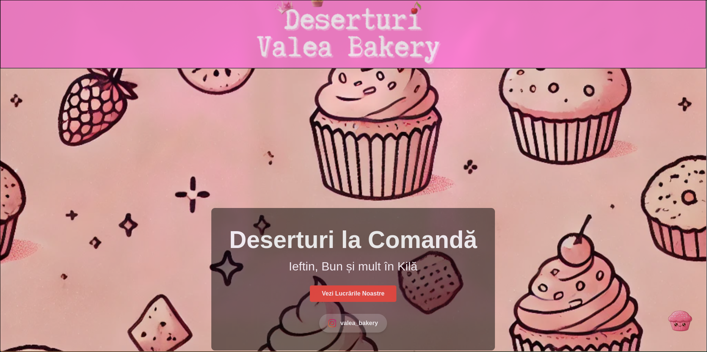
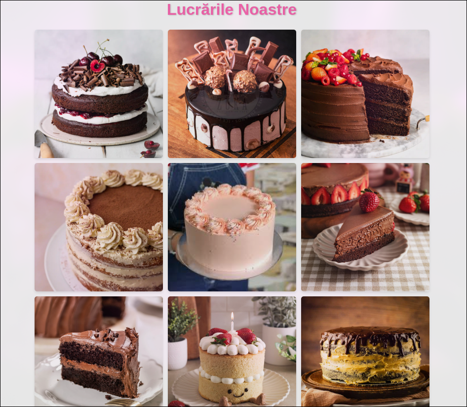

# Deserturi la Comanda - Landing Page

## 1. Introduction

**Deserturi la Comanda** is a visually appealing and interactive landing page created as part of a university laboratory project. The website showcases a custom dessert ordering service, highlighting delicious cakes, customer testimonials, and an easy-to-use ordering system.

The project is focused on delivering a modern and engaging user experience using **vanilla HTML and CSS (without frameworks)**.

## 2. Features

### 2.1 Hero Section
- A beautiful banner image displaying the bakery brand.
- Call-to-action buttons leading to ordering options and a gallery.

### 2.2 Promotional Section
- A **-20% discount** for first-time orders.

### 2.3 Unique Value Proposition (UVP)
- A tagline emphasizing premium ingredients and authentic recipes.
- Customer ratings and testimonials to establish trust.

### 2.4 Customer Reviews
- Displayed in an interactive **card-based** layout.
- Showcases real customer experiences and ratings.

### 2.5 Contact Section
- A popup with ordering options via **Instagram** or **phone**.
- Stylish buttons for easy interaction.

### 2.6 Image Gallery
- A **popup-based image gallery** showcasing custom cakes.
- High-quality images arranged in a responsive grid.

## 3. Technologies Used
- **HTML5** - Structure of the landing page.
- **CSS3** - Styling and responsiveness.
- **JavaScript** - Interactive popups and dynamic elements.

## 4. Screenshots

### Main Page

### Promotional Discount

### Customer Reviews

### Image Gallery

## 5. Live Demo
You can view the live version of the project here:
[**Deserturi la Comanda Live Demo**](https://tum-web-lab2-three.vercel.app/)

---
**Author:** Tofan Liviu  
**Group:** FAF-223

